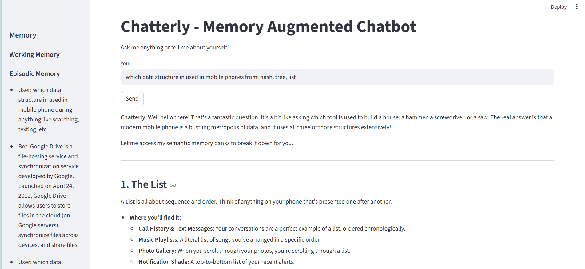
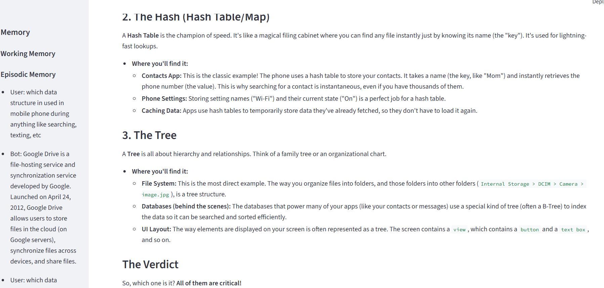
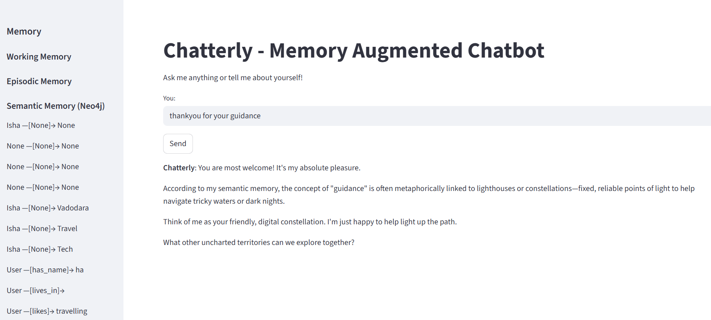

# Chatterly: Memory-Augmented Conversational Agent

Chatterly is a modular, research-grade chatbot system designed to explore memory-augmented dialogue using Gemini LLMs, semantic graphs, and episodic context tracking. Built for academic research and real-world deployment, it integrates multiple memory layers and dynamic model routing to deliver coherent, personalized conversations.

## [Live Demo](https://chatterly-chatbot.streamlit.app/)

## 🔍 Features

- **Modular LLM Routing**: Supports Gemini Pro, Flash, and Lite variants with dynamic selection
- **Semantic Memory Graphs**: Uses Neo4j to store and retrieve contextual knowledge
- **Episodic Memory Tracking**: Captures user interactions for long-term personalization
- **Streamlit Interface**: Clean, responsive UI for real-time interaction and testing
- **Docker-Ready**: Easily deployable across environments
- **Fallback Logic**: Robust handling of LLM errors and memory gaps

## 🧠 Architecture

User Input → Prompt Builder → LLM Router → Gemini API 
↘ Memory Retriever (Neo4j, Qdrant) 
↘ Working Memory (Session Context) 
↘ Episodic Memory (User History)

### 💬 Chatbot Demo

  
  
  

## 🚀 Deployment

### Streamlit Cloud
1. Push to GitHub
2. Go to [streamlit.io/cloud](https://streamlit.io/cloud)
3. Set `src/app.py` as the entry point
4. Add your Gemini API key in Secrets:

### Local
bash
streamlit run src/app.py
docker build -t chatterly .
docker run -p 8501:8501 chatterly

## 🧪 Research Focus

- How semantic memory graphs improve long-term coherence  
- How episodic memory affects personalization  
- Evaluation metrics for memory relevance and citation accuracy

## 🛠️ Tech Stack
Frontend: Streamlit

Backend: Python, Gemini API

Memory: Neo4j, Qdrant

Deployment: Docker, GitHub, Streamlit Cloud

## 📚 Author
Isha G.
[LinkedIn](www.linkedin.com/in/ishathinkso)
